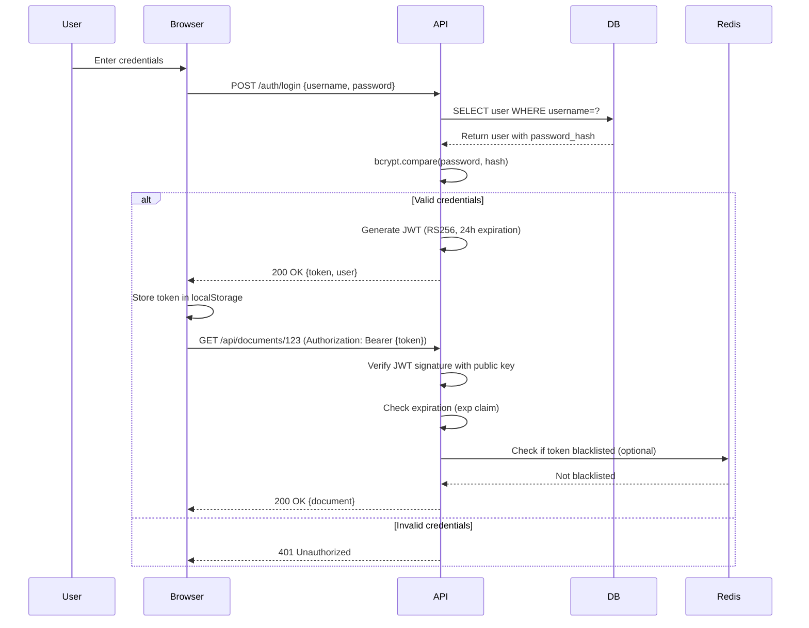

# Backend Architecture

## Service Architecture (Traditional Server)

**Controller/Route Organization:**
```
services/api/src/
├── index.ts                  # Express app entry point
├── routes/
│   ├── auth.routes.ts       # POST /auth/login, /auth/register
│   ├── documents.routes.ts  # GET/POST /api/documents/*
│   ├── admin.routes.ts      # GET/POST /admin/* (protected)
│   └── health.routes.ts     # GET /health, /health/db, /health/redis
├── controllers/
│   ├── auth.controller.ts   # Login/register logic
│   ├── documents.controller.ts  # Document CRUD, approve/reject
│   └── admin.controller.ts  # Data reload, metrics
├── middleware/
│   ├── auth.middleware.ts   # JWT validation
│   ├── error.middleware.ts  # Global error handler
│   └── logger.middleware.ts # Request logging (pino-http)
├── repositories/
│   ├── document.repo.ts     # Database queries for documents
│   ├── user.repo.ts         # Database queries for users
│   └── batch.repo.ts        # Database queries for batches
├── services/
│   ├── file.service.ts      # File move/copy operations
│   └── jwt.service.ts       # Token generation/validation
└── utils/
    ├── db.ts                # PostgreSQL connection pool
    ├── redis.ts             # Redis client setup
    └── logger.ts            # Pino logger config
```

**Controller Template:**
```typescript
// services/api/src/controllers/documents.controller.ts
import { Request, Response } from 'express';
import { documentRepo } from '../repositories/document.repo';
import { fileService } from '../services/file.service';

export async function getDocument(req: Request, res: Response) {
  const { documentId } = req.params;
  const reviewToken = req.query.token as string;

  // Validate review token (alternative to Bearer auth)
  if (reviewToken) {
    const payload = jwtService.verifyReviewToken(reviewToken);
    if (payload.documentId !== documentId) {
      return res.status(403).json({ error: 'Invalid review token' });
    }
  } else if (!req.user) {
    // No review token and not authenticated
    return res.status(401).json({ error: 'Unauthorized' });
  }

  const document = await documentRepo.findById(documentId);
  if (!document) {
    return res.status(404).json({ error: 'Document not found' });
  }

  res.json(document);
}

export async function approveDocument(req: Request, res: Response) {
  const { documentId } = req.params;
  const { destination_folder, filename } = req.body;

  const document = await documentRepo.findById(documentId);
  if (!document) {
    return res.status(404).json({ error: 'Document not found' });
  }

  // Execute file move operation
  const destinationPath = await fileService.moveFile(
    document.scan_path,
    destination_folder,
    filename
  );

  // Update database
  await documentRepo.update(documentId, {
    status: 'filed',
    destination_path: destinationPath,
    user_action: 'approved',
    user_id: req.user.id
  });

  res.json({
    message: 'Document filed successfully',
    destination: destinationPath
  });
}
```

## Database Architecture

**Schema Design:**
(Refer to Database Schema section above for SQL DDL)

**Data Access Layer (Repository Pattern):**
```typescript
// services/api/src/repositories/document.repo.ts
import { pool } from '../utils/db';
import { Document, AnalysisResult } from '@ai-scanner/shared';

export const documentRepo = {
  async findById(id: string): Promise<Document | null> {
    const result = await pool.query(
      'SELECT * FROM documents WHERE id = $1',
      [id]
    );
    return result.rows[0] || null;
  },

  async create(doc: Partial<Document>): Promise<Document> {
    const result = await pool.query(
      `INSERT INTO documents (filename, scan_path, scan_timestamp, status)
       VALUES ($1, $2, $3, $4) RETURNING *`,
      [doc.filename, doc.scan_path, doc.scan_timestamp, doc.status]
    );
    return result.rows[0];
  },

  async update(id: string, updates: Partial<Document>): Promise<void> {
    const fields = Object.keys(updates)
      .map((key, idx) => `${key} = $${idx + 2}`)
      .join(', ');
    const values = Object.values(updates);

    await pool.query(
      `UPDATE documents SET ${fields}, updated_at = CURRENT_TIMESTAMP
       WHERE id = $1`,
      [id, ...values]
    );
  },

  async findAnalyzedNotNotified(): Promise<Document[]> {
    const result = await pool.query(
      `SELECT * FROM documents
       WHERE status = 'analyzed' AND notified = false
       ORDER BY scan_timestamp ASC`
    );
    return result.rows;
  }
};
```

**Database Connection Pool:**
```typescript
// services/api/src/utils/db.ts
import { Pool } from 'pg';

export const pool = new Pool({
  connectionString: process.env.DATABASE_URL,
  max: 20, // Maximum connections
  idleTimeoutMillis: 30000,
  connectionTimeoutMillis: 2000
});

pool.on('error', (err) => {
  logger.error({ err }, 'Unexpected database error');
  process.exit(-1); // Restart container on DB connection loss
});

// Health check function
export async function checkDbHealth(): Promise<boolean> {
  try {
    await pool.query('SELECT 1');
    return true;
  } catch (err) {
    logger.error({ err }, 'Database health check failed');
    return false;
  }
}
```

## Authentication and Authorization

**Auth Flow:**


**Middleware/Guards (JWT Validation):**
```typescript
// services/api/src/middleware/auth.middleware.ts
import jwt from 'jsonwebtoken';
import { Request, Response, NextFunction } from 'express';

const PUBLIC_KEY = process.env.JWT_PUBLIC_KEY.replace(/\\n/g, '\n');

export function authMiddleware(req: Request, res: Response, next: NextFunction) {
  const authHeader = req.headers.authorization;

  if (!authHeader || !authHeader.startsWith('Bearer ')) {
    return res.status(401).json({
      error: { code: 'UNAUTHORIZED', message: 'Missing or invalid token' }
    });
  }

  const token = authHeader.substring(7); // Remove 'Bearer ' prefix

  try {
    const payload = jwt.verify(token, PUBLIC_KEY, { algorithms: ['RS256'] });
    req.user = payload; // Attach user to request object
    next();
  } catch (err) {
    if (err.name === 'TokenExpiredError') {
      return res.status(401).json({
        error: { code: 'TOKEN_EXPIRED', message: 'Token has expired' }
      });
    }
    return res.status(401).json({
      error: { code: 'INVALID_TOKEN', message: 'Invalid token signature' }
    });
  }
}

// Usage in routes:
// routes/documents.routes.ts
import { authMiddleware } from '../middleware/auth.middleware';

router.get('/api/documents/:id', authMiddleware, documentsController.getDocument);
router.post('/api/documents/:id/approve', authMiddleware, documentsController.approveDocument);
```

**Password Hashing (bcrypt):**
```typescript
// services/api/src/controllers/auth.controller.ts
import bcrypt from 'bcrypt';
import { userRepo } from '../repositories/user.repo';
import { jwtService } from '../services/jwt.service';

export async function register(req: Request, res: Response) {
  const { username, password } = req.body;

  // Validate password strength (min 8 chars)
  if (password.length < 8) {
    return res.status(400).json({ error: 'Password must be at least 8 characters' });
  }

  // Hash password with bcrypt (10 rounds)
  const password_hash = await bcrypt.hash(password, 10);

  // Create user
  const user = await userRepo.create({ username, password_hash });

  // Generate JWT for immediate login
  const token = jwtService.generateToken({ user_id: user.id, username: user.username });

  res.status(201).json({ token, user: { id: user.id, username: user.username } });
}

export async function login(req: Request, res: Response) {
  const { username, password } = req.body;

  const user = await userRepo.findByUsername(username);
  if (!user) {
    return res.status(401).json({ error: 'Invalid username or password' });
  }

  const isValid = await bcrypt.compare(password, user.password_hash);
  if (!isValid) {
    return res.status(401).json({ error: 'Invalid username or password' });
  }

  const token = jwtService.generateToken({ user_id: user.id, username: user.username });

  res.json({ token, user: { id: user.id, username: user.username } });
}
```

---
