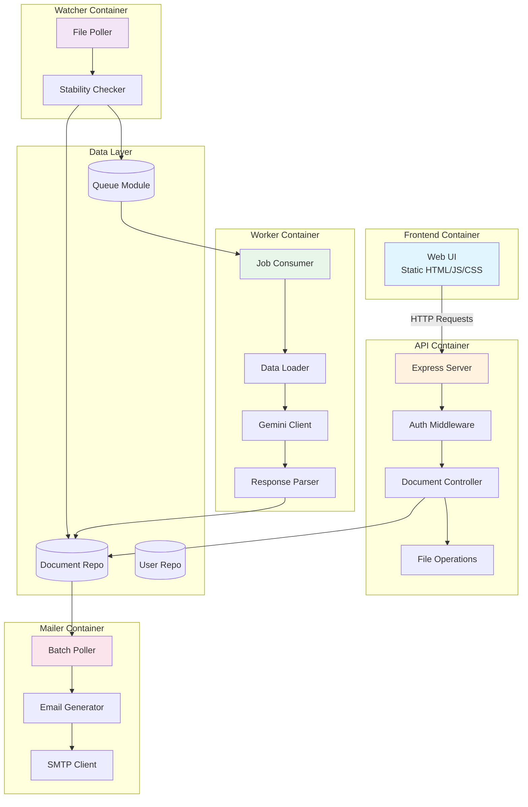

# Components

## Component: File Watcher Service

**Responsibility:** Continuously monitor scan folder for new PDF and image files using polling-based file system checks, detect file creation with stability validation (wait for file writes to complete), and queue discovered documents for AI analysis.

**Key Interfaces:**

- **Outbound:** `queue.addJob(documentData)` - Enqueue document for processing
- **Outbound:** `documentRepo.create(doc)` - Store document metadata in database
- **Inbound:** File system read operations (`fs.readdir`, `fs.stat`) on scan folder path

**Dependencies:**

- PostgreSQL database (via `documentRepo`)
- Redis queue (via `queue` module)
- Host file system (scan folder mounted as Docker volume)

**Technology Stack:**

- Node.js with TypeScript
- `fs/promises` for async file operations
- `chokidar` library (in polling mode) or custom polling loop with `setInterval`
- `pino` logger for structured logging

**Configuration (Environment Variables):**

- `SCAN_FOLDER_PATH` - Path to monitored folder (e.g., `/mnt/scan-folder`)
- `POLL_INTERVAL_MS` - Polling frequency (default 3000ms)
- `FILE_STABILITY_TIMEOUT_MS` - Time to wait for file size stabilization (default 6000ms)
- `SUPPORTED_EXTENSIONS` - Comma-separated list (default: `.pdf,.png,.jpg,.jpeg,.tiff`)

**Operational Notes:**

- Runs as long-lived process in Docker container with restart policy
- Exposes GET `/health` endpoint for monitoring (returns last poll timestamp)
- Graceful shutdown on SIGTERM (stops polling, waits for current operation to complete)
- Handles folder access errors with retry logic (30-second backoff)

---

## Component: Analysis Worker Service

**Responsibility:** Consume document analysis jobs from Redis queue, load external data sources (PO logs, vendor lists, folder structures), extract text and images from documents, send multimodal prompts to Gemini Vision API for classification and routing recommendations, parse and validate AI responses, and update database with analysis results.

**Key Interfaces:**

- **Inbound:** `queue.getNextJob()` - Pop document from processing queue
- **Outbound:** Gemini API (`generateContent` with image + text prompt)
- **Outbound:** `documentRepo.update(id, analysis_result)` - Store AI analysis in database
- **Inbound:** File system read (document files from scan folder)

**Dependencies:**

- PostgreSQL database (via `documentRepo`)
- Redis queue (via `queue` module)
- Google Gemini API (via `@google/generative-ai` SDK)
- File system (scan folder for reading documents)
- External data sources (CSV/JSON files mounted as volumes)

**Technology Stack:**

- Node.js with TypeScript
- `@google/generative-ai` SDK (v0.1.3+) for Gemini integration
- `pdf-parse` or `pdf-lib` for PDF text extraction
- `sharp` for image processing (resizing, format conversion)
- `csv-parser` for loading PO logs and vendor lists
- `pino` logger

**Configuration (Environment Variables):**

- `GEMINI_API_KEY` - Google AI API key (required)
- `GEMINI_MODEL` - Model name (default: `gemini-1.5-flash`)
- `PO_LOGS_PATH` - Path to PO logs CSV
- `VENDOR_LIST_PATH` - Path to vendor list CSV
- `FOLDER_STRUCTURE_PATH` - Path to folder structure JSON
- `GEMINI_RATE_LIMIT_RPM` - Requests per minute limit (default: 15 for free tier)

**Operational Notes:**

- Runs as long-lived process, can scale to multiple instances (queue ensures atomic job consumption)
- Implements circuit breaker for Gemini API (after 3 failures, pause 60s)
- Loads external data sources on startup, reloads on SIGHUP signal
- Large document handling (50+ pages): process only first 5 pages, include context in prompt
- Exposes GET `/health` and GET `/metrics` endpoints (last job processed, average confidence score, failure rate)

---

## Component: Express API Service

**Responsibility:** Serve as central HTTP gateway providing REST endpoints for authentication, document metadata retrieval, approval/rejection actions, and static file hosting for frontend web UI.

**Key Interfaces:**

- **Inbound:** HTTP requests from web browser (frontend)
- **Outbound:** `documentRepo.findById(id)` - Fetch document data
- **Outbound:** `userRepo.authenticate(username, password)` - Validate credentials
- **Outbound:** File system write (move/copy operations for approved documents)
- **Outbound:** Redis cache (session storage, rate limiting counters)

**Dependencies:**

- PostgreSQL database (via `documentRepo`, `userRepo`)
- Redis cache (via `redisClient` module)
- File system (scan folder for reading, output folders for writing)
- JWT library (`jsonwebtoken`) for auth token generation/validation

**Technology Stack:**

- Node.js with TypeScript
- `express` framework (v4.18+)
- `jsonwebtoken` for JWT auth (RS256 algorithm)
- `bcrypt` for password hashing (10 rounds)
- `helmet` middleware for security headers
- `cors` middleware (allow frontend origin)
- `express-rate-limit` for API rate limiting
- `pino-http` for request logging

**Configuration (Environment Variables):**

- `PORT` - HTTP listen port (default: 3000)
- `JWT_PRIVATE_KEY` - RS256 private key (PEM format)
- `JWT_PUBLIC_KEY` - RS256 public key (PEM format)
- `REVIEW_TOKEN_SECRET` - Secret for short-lived review tokens (HS256)
- `ALLOWED_ORIGINS` - CORS allowed origins (comma-separated)
- `OUTPUT_FOLDER_BASE` - Base path for output folders

**Operational Notes:**

- Serves static files from `frontend/` directory at root path (`/`)
- Authentication middleware validates JWT on protected routes
- Graceful shutdown closes database connections, flushes Redis buffers
- HTTPS via reverse proxy (Nginx/Traefik) or self-signed cert for development
- Exposes GET `/health`, GET `/health/db`, GET `/health/redis` for monitoring

---

## Component: Email Service (Mailer)

**Responsibility:** Monitor database for analyzed documents, implement 15-second idle trigger to batch multiple documents into single email summary, generate HTML email templates with document thumbnails and AI recommendations, and deliver batch notification emails via SMTP.

**Key Interfaces:**

- **Inbound:** Database polling (`SELECT * FROM documents WHERE status='analyzed' AND notified=false`)
- **Outbound:** SMTP server (via `nodemailer`)
- **Outbound:** `documentRepo.update(id, { notified: true })` - Mark documents as notified
- **Outbound:** `batchRepo.create(batch)` - Store batch metadata
- **Inbound:** File system read (document thumbnails generation)

**Dependencies:**

- PostgreSQL database (via `documentRepo`, `batchRepo`)
- SMTP server (Gmail, SendGrid, AWS SES, or local relay)
- File system (scan folder for reading documents to generate thumbnails)

**Technology Stack:**

- Node.js with TypeScript
- `nodemailer` for SMTP email delivery
- `handlebars` or `mustache` for HTML template rendering
- `sharp` for thumbnail generation (resize to 200px width)
- `pino` logger

**Configuration (Environment Variables):**

- `SMTP_HOST` - SMTP server hostname
- `SMTP_PORT` - SMTP port (default: 587 for TLS, 465 for SSL)
- `SMTP_USER` - SMTP authentication username
- `SMTP_PASS` - SMTP authentication password
- `SMTP_FROM` - Sender email address
- `NOTIFICATION_EMAIL` - Recipient email address (single user for MVP)
- `BATCH_IDLE_TIMEOUT_MS` - Idle time before sending email (default: 15000ms)
- `WEB_UI_BASE_URL` - Base URL for review links (e.g., `https://ai-scanner.local`)

**Operational Notes:**

- Runs as long-lived process with 2-second polling interval
- Generates review tokens as short-lived JWTs (4-hour expiration)
- Email template includes plain text fallback for non-HTML clients
- Retry logic for failed sends (3 attempts with exponential backoff)
- Failed batches logged for manual investigation
- Exposes GET `/health` (last batch sent timestamp) and GET `/admin/batches` (batch history)

---

## Component: Shared Package

**Responsibility:** Provide shared TypeScript type definitions, utility functions, and constants used across frontend and backend services to ensure type safety and code reuse in monorepo.

**Key Interfaces:**

- **Exports:** TypeScript interfaces (`Document`, `User`, `AnalysisResult`, etc.)
- **Exports:** Utility functions (filename sanitization, path validation, date formatting)
- **Exports:** Constants (file extensions, status enums, API error codes)

**Dependencies:** None (standalone package)

**Technology Stack:**

- TypeScript (type definitions only, no runtime code)
- Pure JavaScript utilities (no external dependencies for maximum portability)

**Package Contents:**

```
shared/
├── src/
│   ├── types/
│   │   ├── document.ts          # Document, AnalysisResult interfaces
│   │   ├── user.ts              # User, UserDTO interfaces
│   │   ├── queue.ts             # QueueJob, ProcessingQueue interfaces
│   │   └── api.ts               # API request/response types
│   ├── utils/
│   │   ├── filename.ts          # sanitizeFilename(), validateFilename()
│   │   ├── paths.ts             # normalizePath(), validateFolderPath()
│   │   └── dates.ts             # formatTimestamp(), parseDate()
│   ├── constants/
│   │   ├── statuses.ts          # Document status enum
│   │   ├── errors.ts            # API error codes
│   │   └── config.ts            # Default values (poll intervals, etc.)
│   └── index.ts                 # Re-export all modules
└── package.json
```

**Usage Example:**

```typescript
// In frontend/src/api/documents.ts
import { Document, AnalysisResult } from '@ai-scanner/shared';

// In services/worker/src/validator.ts
import { sanitizeFilename } from '@ai-scanner/shared/utils/filename';
```

---

## Component Diagrams



**Component Interaction Notes:**

- All services communicate asynchronously (no direct HTTP calls between backend services)
- Database serves as state coordination layer (no service-to-service messaging)
- Queue decouples producer (watcher) from consumer (worker) for resilience
- Redis pub/sub used for optional real-time updates (worker notifies mailer when analysis complete)

---
