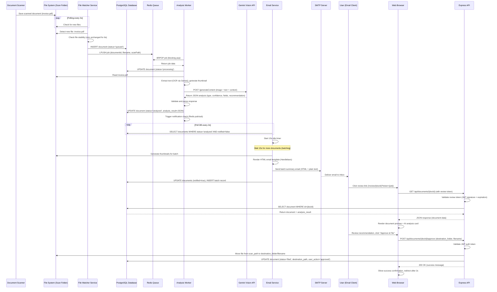

# Core Workflows

## Workflow: End-to-End Document Processing

This sequence diagram illustrates the complete lifecycle of a scanned document from detection through AI analysis to user approval and final filing.

**Error Handling Paths (Not Shown Above):**

- **File Lock Detected:** Watcher retries stability check for up to 30 seconds, then marks document as `failed` with error message
- **Gemini API Timeout:** Worker retries job 3 times, then updates status to `analysis_failed`
- **SMTP Send Failure:** Mailer retries 3 times with exponential backoff, marks batch as `send_failed` for manual investigation
- **File Operation Failure (Approval):** API returns 500 error, frontend shows retry button, document stays in `analyzed` state

**Performance Optimizations:**

- Worker processes documents in parallel (multiple worker instances can run simultaneously)
- Frontend uses optimistic UI (shows success immediately while file operation completes in background)
- Batch email reduces SMTP overhead (single email for multiple documents vs individual emails)
- Redis blocking pop (`BRPOP`) eliminates polling overhead in worker (waits for job instead of checking every second)

---
