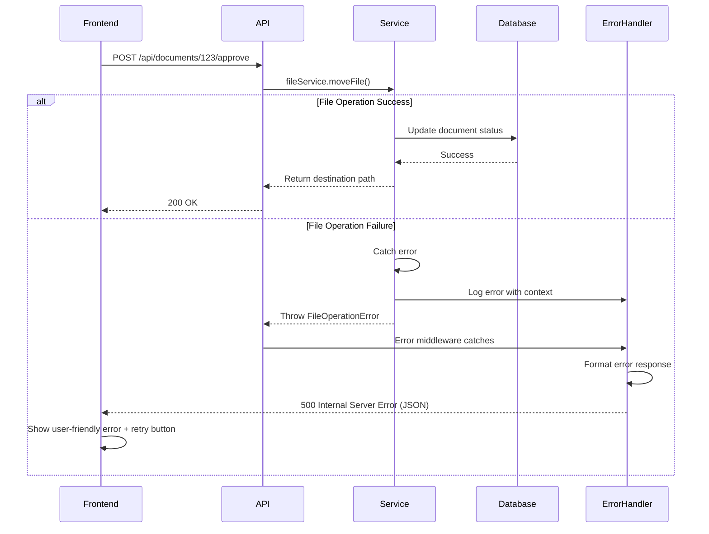

# Error Handling Strategy

## Error Flow



## Error Response Format

```typescript
// Standardized API error response
interface ApiError {
  error: {
    code: string;          // Machine-readable error code (e.g., "FILE_OPERATION_FAILED")
    message: string;       // Human-readable message (e.g., "Unable to move file")
    details?: Record<string, any>;  // Optional additional context
    timestamp: string;     // ISO 8601 timestamp
    requestId: string;     // UUID for request tracing
  };
}

// Example error response:
{
  "error": {
    "code": "FILE_OPERATION_FAILED",
    "message": "Unable to move file: Permission denied",
    "details": {
      "source": "/mnt/scan-folder/invoice.pdf",
      "destination": "/mnt/output/Quality/invoice.pdf",
      "errno": -13
    },
    "timestamp": "2025-10-03T14:30:52.123Z",
    "requestId": "550e8400-e29b-41d4-a716-446655440000"
  }
}
```

## Frontend Error Handling

```javascript
// frontend/js/api/client.js
export async function apiFetch(endpoint, options = {}) {
  try {
    const response = await fetch(API_BASE_URL + endpoint, options);

    if (!response.ok) {
      const error = await response.json();

      // Special handling for auth errors
      if (response.status === 401) {
        localStorage.removeItem('auth_token');
        window.location.href = '/login';
        throw new Error('Session expired');
      }

      // Throw structured error
      throw new ApiError(error.error.code, error.error.message, error.error.details);
    }

    return response.json();
  } catch (err) {
    // Network errors (fetch failed)
    if (!err.code) {
      throw new Error('Unable to connect. Please check your internet connection.');
    }
    throw err;
  }
}

// Custom error class
class ApiError extends Error {
  constructor(code, message, details) {
    super(message);
    this.code = code;
    this.details = details;
  }
}

// Usage in ReviewPage.js:
async function handleApprove() {
  try {
    await approveDocument(documentId, { destination_folder, filename });
    showSuccessPage();
  } catch (err) {
    if (err.code === 'FILE_OPERATION_FAILED') {
      showError('Unable to file document. Please check folder permissions and try again.', {
        retry: () => handleApprove() // Retry button
      });
    } else {
      showError('An unexpected error occurred. Please try again later.');
    }
    logger.error({ err, documentId }, 'Approval failed');
  }
}
```

## Backend Error Handling

```typescript
// services/api/src/middleware/error.middleware.ts
import { Request, Response, NextFunction } from 'express';
import { v4 as uuidv4 } from 'uuid';
import { logger } from '../utils/logger';

export function errorHandler(err: Error, req: Request, res: Response, next: NextFunction) {
  const requestId = uuidv4();

  // Log error with full context
  logger.error({
    err,
    requestId,
    method: req.method,
    path: req.path,
    body: req.body,
    user: req.user?.id
  }, 'Request error');

  // Map errors to status codes
  let statusCode = 500;
  let errorCode = 'INTERNAL_SERVER_ERROR';

  if (err.name === 'ValidationError') {
    statusCode = 400;
    errorCode = 'VALIDATION_ERROR';
  } else if (err.name === 'FileOperationError') {
    statusCode = 500;
    errorCode = 'FILE_OPERATION_FAILED';
  } else if (err.name === 'NotFoundError') {
    statusCode = 404;
    errorCode = 'NOT_FOUND';
  }

  // Send structured error response
  res.status(statusCode).json({
    error: {
      code: errorCode,
      message: err.message,
      details: err.details || {},
      timestamp: new Date().toISOString(),
      requestId
    }
  });
}

// Custom error classes
export class FileOperationError extends Error {
  name = 'FileOperationError';
  details: Record<string, any>;

  constructor(message: string, details: Record<string, any>) {
    super(message);
    this.details = details;
  }
}

export class ValidationError extends Error {
  name = 'ValidationError';
  details: Record<string, any>;

  constructor(message: string, details: Record<string, any>) {
    super(message);
    this.details = details;
  }
}

// Usage in file.service.ts:
import { FileOperationError } from '../middleware/error.middleware';

export async function moveFile(source: string, destFolder: string, filename: string) {
  try {
    const dest = path.join(destFolder, filename);
    await fs.rename(source, dest);
    return dest;
  } catch (err) {
    throw new FileOperationError('Unable to move file: ' + err.message, {
      source,
      destination: path.join(destFolder, filename),
      errno: err.errno
    });
  }
}
```

---
