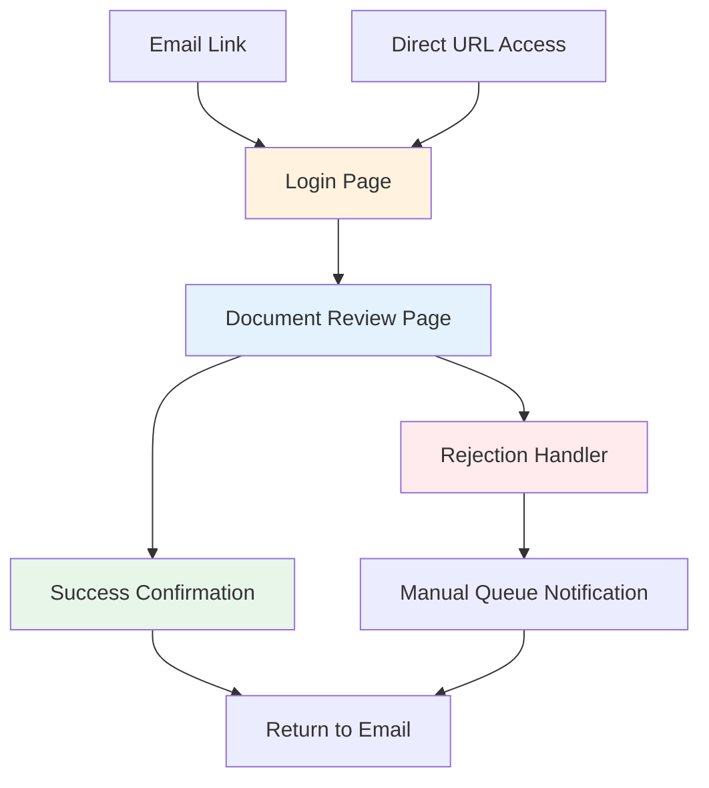
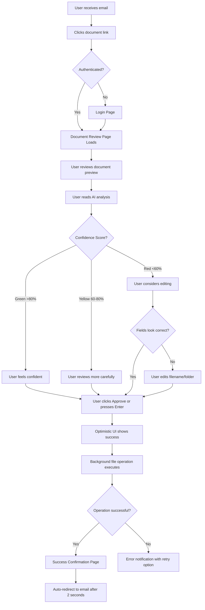
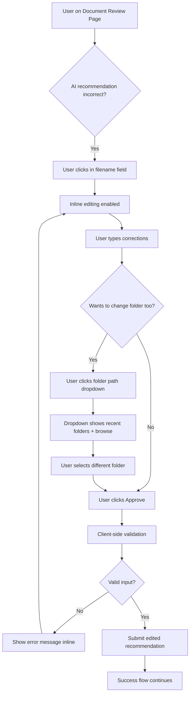
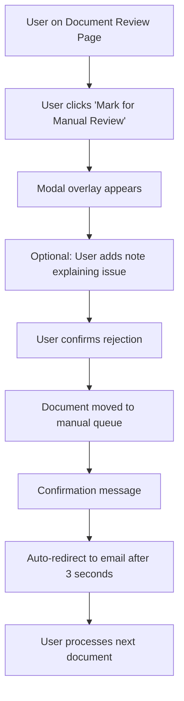
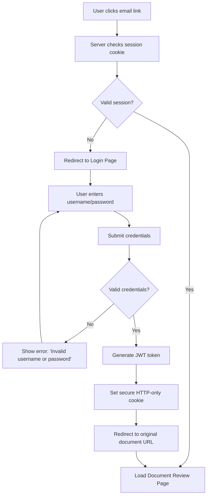

# ai.scanner UI/UX Specification

This document defines the user experience goals, information architecture, user flows, and visual design specifications for ai.scanner's user interface. It serves as the foundation for visual design and frontend development, ensuring a cohesive and user-centered experience.

## Overall UX Goals & Principles

### Target User Personas

**1. QMS Manager (Primary Persona)**
- **Profile:** Compliance officer at small-medium manufacturing company (10-200 employees), managing ISO 9001/AS9100 document filing
- **Technical Level:** Moderate—comfortable with Windows networks, basic software configuration, not a developer
- **Daily Context:** Receives 5-50 scanned documents daily (packing lists, POs, inspection reports), must file accurately for audit compliance
- **Pain Points:** Abbreviated vendor names on documents, fear of audit findings, training new staff on complex folder structures
- **Goals:** Fast routing during busy receiving periods, maintain audit-ready filing system, reduce administrative burden
- **Success Metric:** Review and approve 10 documents in <3 minutes (vs 30 minutes manually)

**2. Medical Office Staff (Secondary Persona)**
- **Profile:** Administrative staff at small medical practice (1-5 providers), handling patient charts and insurance forms
- **Technical Level:** Basic—uses email and EHR systems, prefers simple interfaces
- **Daily Context:** Scans 20-50 multi-page patient documents after appointments, must maintain HIPAA-compliant filing
- **Pain Points:** Large document volumes, patient privacy risks from misfiling, after-hours administrative work
- **Goals:** HIPAA compliance, accurate patient record filing, free up time for patient-facing activities
- **Success Metric:** Complete document filing between patient appointments (<5 minute windows)

**3. Power User/IT Administrator (Tertiary Persona)**
- **Profile:** Technical user setting up and maintaining ai.scanner for their organization
- **Technical Level:** High—comfortable with Docker, .env configuration, command line tools
- **Context:** One-time setup, occasional system configuration updates, troubleshooting
- **Goals:** Quick deployment (<15 minutes), reliable operation, minimal maintenance
- **Success Metric:** System runs 7+ days without intervention

### Usability Goals

1. **Ease of Learning:** New users can review and approve their first document within 2 minutes of clicking email link (no training required)
2. **Efficiency of Use:** Power users can approve documents with keyboard shortcuts (Enter key) without mouse interaction
3. **Error Prevention:** AI confidence scores provide clear visual indicators (green/yellow/red), warn users before low-confidence approvals
4. **Trust Building:** Transparent AI reasoning ("Found PO-12345 matching vendor ABC Corp from recent orders") builds confidence in recommendations
5. **Memorability:** Infrequent users return without relearning—single-page interface with no hidden features
6. **Forgiveness:** Users can reject recommendations without penalty, edit fields freely, and view proposed file operations before execution
7. **Accessibility:** WCAG AA compliance ensures keyboard navigation, screen reader support, and sufficient color contrast

### Design Principles

1. **Transparency Over Magic** - Show AI reasoning, confidence scores, and proposed file operations. Users trust what they understand.

2. **Invisible When Right, Helpful When Wrong** - Correct recommendations require minimal review time; incorrect ones provide clear edit paths without frustration.

3. **One Action to Approve** - Primary workflow (approve) should be single-click/keypress. Secondary actions (edit, reject) can require more steps.

4. **Document-Centric Layout** - The scanned document is the hero—large preview, readable text, clear metadata. UI controls are supporting cast.

5. **Mobile-Functional, Desktop-Optimized** - Desktop users get full-featured experience; mobile users get "good enough" for emergency reviews.

### Change Log

| Date | Version | Description | Author |
|------|---------|-------------|---------|
| 2025-10-03 | 1.0 | Initial UI/UX Specification | Sally (UX Expert) |

---

## Information Architecture (IA)

### Site Map / Screen Inventory



**Screen Count:** 5 core screens (Login, Document Review, Success, Rejection, Manual Queue)

**Navigation Pattern:** Linear workflow—no dashboard or multi-document browsing in MVP. Each email link routes to specific document review page.

### Navigation Structure

**Primary Navigation:** None—single-purpose application with linear workflow. Each document review is isolated session accessed via email link.

**Secondary Navigation:** Minimal UI controls on Document Review page:
- "Log Out" link in header (top-right)
- "Mark for Manual Review" button (rejection path)
- Breadcrumb-style document identifier (e.g., "Document 3 of 8 in batch from 10:45 AM")

**Breadcrumb Strategy:** Not applicable for MVP—users don't navigate hierarchically. Document context shown as simple text label ("Processing document: invoice_scan_20251003.pdf").

**Rationale:** Email-driven architecture eliminates need for complex navigation. Each document is atomic unit accessed independently. Future phases may add dashboard for batch processing, but MVP optimizes for single-document focus per session.

---

## User Flows

### Flow 1: Primary Approval Workflow (Happy Path)

**User Goal:** Review AI recommendation and approve correct routing for scanned document

**Entry Points:**
- Click document link in batch summary email
- Direct URL access (if user bookmarked/saved link)

**Success Criteria:**
- Document filed to correct folder with proper filename
- User sees confirmation within 3 seconds of approval
- File operation completes successfully in background

#### Flow Diagram



#### Edge Cases & Error Handling:

- **Session timeout during review:** User redirected to login with return URL preserved, no data loss
- **File already exists at destination:** System appends timestamp suffix, shows warning in confirmation
- **Network folder unavailable:** Error message with clear action ("Check folder access, contact IT")
- **Concurrent edits (another user approved same doc):** Lock conflict detected, show "Already processed by [user]" message
- **Large document preview fails to load:** Show first page thumbnail + "Preview unavailable, full document will be filed" notice
- **User closes browser before approval:** Document remains in queue, accessible via email link later

**Notes:** This is 85% of expected usage. Optimized for speed—minimal clicks, keyboard shortcuts, immediate feedback.

---

### Flow 2: Edit and Approve Workflow

**User Goal:** Correct AI recommendation errors before approving routing

**Entry Points:** Same as Flow 1 (email link)

**Success Criteria:**
- User successfully edits filename and/or folder path
- Edited values validate correctly (no illegal characters, path exists)
- Document files with user's corrections, not AI's original suggestion

#### Flow Diagram



#### Edge Cases & Error Handling:

- **Invalid characters in filename:** Real-time validation highlights illegal characters (/ \ : * ? " < > |), shows corrected suggestion
- **Duplicate filename at destination:** Warning overlay: "File exists. Append (1)? Or overwrite?" with explicit choice
- **Folder path doesn't exist:** Dropdown grayed out, show "Folder unavailable—contact admin" tooltip
- **User edits then changes mind:** "Reset to AI suggestion" link restores original values

**Notes:** Must preserve AI's original recommendation in edit history for feedback loop. Track which fields users edit most frequently to improve prompt engineering.

---

### Flow 3: Rejection / Manual Review Workflow

**User Goal:** Flag document for manual handling when AI recommendation is completely wrong

**Entry Points:** Document Review Page when user can't fix via editing

**Success Criteria:**
- Document marked for manual queue
- User not blocked from continuing with other documents
- Clear notification of what happens next with rejected document

#### Flow Diagram



#### Edge Cases & Error Handling:

- **User rejects all documents in batch:** Show summary "8 documents marked for manual review—check manual queue folder"
- **Manual queue folder full/unavailable:** Fallback to leaving document in original scan folder with ".pending" flag file
- **User rejects by accident:** No undo in MVP—document goes to manual queue (user can still access folder directly)

**Notes:** Rejection is low-friction escape hatch, not failure state. Communicate "We'll handle this manually" not "Error."

---

### Flow 4: Authentication Flow

**User Goal:** Securely access document review interface

**Entry Points:**
- First-time access from email link
- Session expired
- Logout then return

**Success Criteria:**
- User authenticates successfully
- Session persists across multiple document reviews
- Secure token handling (JWT)

#### Flow Diagram



#### Edge Cases & Error Handling:

- **User forgets password:** "Reset password" link sends email with temporary link (future: reset flow; MVP: contact admin message)
- **Multiple failed login attempts:** After 5 attempts, 15-minute lockout with clear timer message
- **Session expires mid-review:** Graceful redirect to login preserving document ID in return URL
- **Remember me checkbox:** 30-day session vs 1-day default

**Notes:** MVP uses simple username/password. Future: magic links (passwordless), SSO for enterprise.

---

## Wireframes & Mockups

**Primary Design Files:** To be created in Figma (recommended) or as high-fidelity HTML/CSS prototypes

### Key Screen Layouts

#### Screen 1: Login Page

**Purpose:** Secure authentication gate for document review access

**Key Elements:**
- Centered login card (max-width 400px) on neutral background
- "ai.scanner" logo/wordmark at top
- Username field (text input, labeled)
- Password field (password input, labeled, show/hide toggle icon)
- "Remember me" checkbox (optional, unchecked by default)
- "Log In" primary button (full-width, blue)
- Error message area (red text, appears above form on failure)

**Interaction Notes:**
- Enter key submits form from any field
- Focus auto-placed on username field on page load
- Password visibility toggle uses eye icon (standard pattern)
- Loading spinner replaces button text during submission

**Design File Reference:** `figma.com/file/ai-scanner/login-screen` (placeholder)

---

#### Screen 2: Document Review Page (PRIMARY INTERFACE)

**Purpose:** Single-page interface for reviewing AI analysis and approving document routing

**Key Elements:**
- **Header Bar** (fixed top):
  - "ai.scanner" logo (left)
  - Document context text: "Document 3 of 8 from batch 10:45 AM" (center)
  - "Log Out" link (right)

- **Main Content Area** (2-column layout on desktop, stacked on mobile):

  **Left Column (60% width):**
  - Large document preview (embedded PDF viewer or image, scrollable if multi-page)
  - Zoom controls (± buttons, fit-to-width)
  - Page indicator for multi-page docs ("Page 1 of 5")

  **Right Column (40% width):**
  - **AI Analysis Card** (white card with border):
    - Confidence score badge (large, color-coded: green/yellow/red, shows percentage)
    - Document type (bold text, e.g., "Packing List")
    - Extracted metadata (vendor, PO number, date) in key-value pairs
    - AI reasoning text (2-3 sentence explanation in conversational tone)

  - **Routing Recommendation** (white card below analysis):
    - "Proposed Folder" (editable dropdown/text field)
    - "Filename" (editable text input, shows suggested name)
    - Preview of full file path (read-only, gray text)

  - **Action Buttons** (bottom of right column):
    - "Approve & File" (large primary button, green, keyboard shortcut: Enter)
    - "Mark for Manual Review" (secondary button, yellow/orange, smaller)

**Interaction Notes:**
- Keyboard shortcuts overlay (dismissible tooltip on first visit): "Press Enter to approve, Esc to reject"
- Inline editing: click any field to edit, Tab to next field, Shift+Tab to previous
- Real-time validation: filename field shows character count, highlights invalid characters
- Optimistic UI: Approve button shows checkmark + "Filing..." text immediately on click
- Mobile adaptation: Stacked single-column layout, document preview collapsible accordion

**Design File Reference:** `figma.com/file/ai-scanner/document-review-page` (placeholder)

---

#### Screen 3: Success Confirmation

**Purpose:** Brief feedback confirming successful file operation

**Key Elements:**
- Centered success card (max-width 500px)
- Large checkmark icon (green, animated check-draw on load)
- Success message: "Document filed successfully!"
- Filed location path (small gray text)
- Auto-redirect countdown: "Returning to email in 3... 2... 1..."
- Manual link: "Process another document" (returns to email)

**Interaction Notes:**
- Auto-redirects after 2 seconds (gives user time to see confirmation)
- User can click manual link to skip countdown
- Success animation plays once (no loop)

**Design File Reference:** `figma.com/file/ai-scanner/success-confirmation` (placeholder)

---

#### Screen 4: Rejection Handler (Manual Queue)

**Purpose:** Allow user to flag document for manual processing with optional note

**Key Elements:**
- Modal overlay (semi-transparent dark background)
- Centered modal card (max-width 450px, white)
- Title: "Mark for Manual Review"
- Optional text area: "Add a note (optional)" (150 char limit, shows count)
- Explanation text: "This document will be moved to the manual queue folder for review."
- Two buttons: "Confirm" (yellow/orange), "Cancel" (gray outline)

**Interaction Notes:**
- Modal opens on "Mark for Manual Review" button click
- Click outside modal or press Esc to cancel (returns to document review)
- Confirm button submits note (if any) and processes rejection
- Modal closes on successful submission, shows success message, then redirects

**Design File Reference:** `figma.com/file/ai-scanner/rejection-modal` (placeholder)

---

## Component Library / Design System

**Design System Approach:** Create minimal custom component library for MVP (not using pre-built framework like Material-UI or Bootstrap). Focus on 8-10 core components that can be composed into all screens. Prioritize consistency over variety—reuse same button styles, card patterns, form inputs across all views.

**Rationale:** Pre-built design systems add bloat and require customization effort. Custom lightweight library gives precise control over accessibility, performance, and brand consistency for this specific use case. Future phases can adopt established design system if scaling needs warrant.

### Core Components

#### Component: Button

**Purpose:** Primary interactive element for user actions (approve, reject, login)

**Variants:**
- **Primary:** Blue background (#2563eb), white text, full rounded corners (8px)
- **Secondary:** White background, gray border, dark text
- **Danger:** Red background (#dc2626), white text (for destructive actions, not used in MVP)
- **Ghost:** Transparent background, colored text (for low-emphasis actions like "Cancel")

**States:**
- Default (idle)
- Hover (darker shade, subtle lift shadow)
- Active/Pressed (inner shadow, no lift)
- Disabled (50% opacity, no pointer)
- Loading (spinner replaces text content)

**Usage Guidelines:**
- Maximum one primary button per screen/card (guides user to main action)
- Button text uses action verbs ("Approve & File" not "Submit")
- Full-width on mobile (<768px), auto-width on desktop
- Minimum touch target: 44×44px (WCAG requirement)

---

#### Component: Input Field (Text)

**Purpose:** User-editable text fields (username, password, filename, notes)

**Variants:**
- **Standard:** Single-line text input with label above
- **Password:** Single-line with show/hide toggle icon
- **Textarea:** Multi-line for notes/descriptions

**States:**
- Default (gray border, white background)
- Focus (blue border, glow shadow)
- Error (red border, error icon, red helper text below)
- Disabled (gray background, not editable)
- Success (green border, checkmark icon—for validated fields)

**Usage Guidelines:**
- Always include visible label (not just placeholder)
- Helper text below field for format instructions (e.g., "No special characters: / \ : *")
- Error messages specific and actionable ("Filename contains illegal character ':'. Remove it to continue.")
- Autofocus on first field for login/modal forms

---

#### Component: Card

**Purpose:** Container for related content sections (AI analysis, routing recommendation)

**Variants:**
- **Standard:** White background, subtle border (1px gray), rounded corners (12px), padding (24px)
- **Elevated:** Standard + box shadow for emphasis (used sparingly)

**States:**
- Default (static)
- Hover (very subtle shadow increase—only for clickable cards in future features)

**Usage Guidelines:**
- Use for grouping related information (don't wrap entire page in one card)
- Stack vertically with 16px gap on mobile, horizontal on desktop when space allows
- Maximum width 600px for readability (text content)

---

#### Component: Badge

**Purpose:** Display confidence scores and status indicators

**Variants:**
- **Confidence Score:** Large circle badge (80px diameter) with percentage text
  - Green (#10b981) for >80%
  - Yellow (#f59e0b) for 60-80%
  - Red (#ef4444) for <60%
- **Status Badge:** Small pill-shaped badge for document states (e.g., "Processing", "Filed")

**States:**
- Static (no interactivity)

**Usage Guidelines:**
- Confidence score badge always prominent in AI Analysis Card (top-right corner)
- Color alone not sufficient—include percentage text for accessibility
- Use semantic color meanings consistently (green=high confidence, not just "good")

---

#### Component: Document Preview

**Purpose:** Display scanned document for user review

**Variants:**
- **PDF Embed:** Uses browser's native PDF viewer (iframe with src pointing to document)
- **Image Display:** For JPEG/PNG scans, uses img tag with zoom controls

**States:**
- Loading (skeleton placeholder or spinner)
- Loaded (displays document)
- Error (placeholder image with "Preview unavailable" message)

**Usage Guidelines:**
- Minimum height 600px on desktop (allows reading without scroll for most documents)
- Responsive scaling on mobile (100% width, height auto)
- Provide fallback for browsers without native PDF support (link to download)
- Add zoom controls for image previews (+ / - buttons, fit-to-width)

---

#### Component: Modal Overlay

**Purpose:** Display focused interactions (rejection handler, confirmation dialogs)

**Variants:**
- **Standard:** Semi-transparent dark background (rgba(0,0,0,0.5)), centered white card

**States:**
- Open (visible with fade-in animation 200ms)
- Closed (fade-out animation 200ms before unmounting)

**Usage Guidelines:**
- Close on Esc key press or click outside modal (unless destructive action requires explicit choice)
- Trap focus within modal when open (Tab cycles through modal elements only)
- Include visible close button (X icon top-right) in addition to Cancel action
- Maximum one modal at a time (no stacking)

---

#### Component: Dropdown Select

**Purpose:** User selection from predefined options (folder paths)

**Variants:**
- **Standard:** Clickable field that opens dropdown menu below
- **Searchable:** Includes filter input at top of dropdown (for large folder lists)

**States:**
- Closed (looks like text input with down arrow icon)
- Open (dropdown menu visible, up arrow icon)
- Focus (blue outline on trigger field)
- Disabled (grayed out)

**Usage Guidelines:**
- Show most-recently-used folders at top of list (common selections first)
- Include "Browse..." option at bottom to open folder picker (future feature)
- Keyboard navigation: Arrow keys to move, Enter to select, Esc to close
- Maximum dropdown height 300px before scrolling

---

#### Component: Loading Spinner

**Purpose:** Indicate background processing or data loading

**Variants:**
- **Inline:** Small spinner (20px) for button loading states
- **Full-page:** Large spinner (60px) centered on screen for page transitions

**States:**
- Spinning (continuous rotation animation)

**Usage Guidelines:**
- Always include aria-label for screen readers ("Processing document...")
- Use sparingly—prefer optimistic UI where possible
- Timeout after 30 seconds with error message if operation doesn't complete

---

## Branding & Style Guide

### Visual Identity

**Brand Guidelines:** Minimal branding for MVP—focus is on functionality and document content, not marketing aesthetic. Professional, trustworthy, tool-oriented design language. Future versions may expand brand identity based on community feedback.

**Core Brand Values Reflected in Design:**
- **Transparency:** Open-source ethos → clean, readable code-inspired UI (monospace for technical details)
- **Intelligence:** AI-powered → subtle "smart" visual cues (confidence score badges, reasoning explanations)
- **Efficiency:** Speed-focused → minimal chrome, fast-loading components, keyboard shortcuts
- **Trust:** Compliance-safe → professional color palette, clear action previews, explicit confirmations

### Color Palette

| Color Type | Hex Code | Usage |
|------------|----------|-------|
| Primary | #2563eb | Primary buttons, links, focus states, brand accents |
| Secondary | #64748b | Secondary text, borders, inactive states |
| Accent | #0891b2 | Highlights, info badges (optional—use sparingly) |
| Success | #10b981 | High confidence scores (>80%), success confirmations, checkmarks |
| Warning | #f59e0b | Medium confidence scores (60-80%), caution notices |
| Error | #ef4444 | Low confidence scores (<60%), error messages, validation failures |
| Neutral | #f8fafc (bg), #1e293b (text), #e2e8f0 (borders) | Backgrounds, body text, dividers, neutral UI chrome |

**Rationale:** Using Tailwind CSS default color palette (with slight tweaks) for accessibility-tested contrast ratios and developer familiarity. Colors have semantic meaning (not decorative)—green always means high confidence/success, red always means low confidence/error.

### Typography

#### Font Families

- **Primary:** "Inter", -apple-system, BlinkMacSystemFont, "Segoe UI", Roboto, "Helvetica Neue", Arial, sans-serif
- **Secondary (headings):** Same as primary (no separate display font for MVP simplicity)
- **Monospace:** "Fira Code", "Consolas", "Monaco", "Courier New", monospace (for file paths, technical details)

**Rationale:** Inter is open-source, highly legible, excellent at small sizes (important for document metadata). System font stack as fallback ensures fast loading. Monospace for file paths improves scannability and signals "technical content."

#### Type Scale

| Element | Size | Weight | Line Height |
|---------|------|--------|-------------|
| H1 | 32px (2rem) | 700 (Bold) | 1.2 (38px) |
| H2 | 24px (1.5rem) | 600 (Semibold) | 1.3 (31px) |
| H3 | 20px (1.25rem) | 600 (Semibold) | 1.4 (28px) |
| Body | 16px (1rem) | 400 (Regular) | 1.5 (24px) |
| Small | 14px (0.875rem) | 400 (Regular) | 1.4 (20px) |
| Button | 16px (1rem) | 500 (Medium) | 1 (16px) |
| Label | 14px (0.875rem) | 500 (Medium) | 1.4 (20px) |

**Rationale:** 16px base size for body text (WCAG recommendation for readability). 1.5 line-height for comfortable reading of multi-line content. Bold weights (600-700) reserved for headings and key UI elements to create clear hierarchy.

### Iconography

**Icon Library:** Heroicons 2.0 (open-source, designed by Tailwind Labs)
- Outline style (24×24px) for general UI icons
- Solid style (20×20px) for badges and small indicators

**Icon Usage:**
- Check circle (success confirmations)
- X circle (errors, close buttons)
- Eye / Eye-slash (password visibility toggle)
- Magnifying glass + / - (zoom controls)
- Arrow path (loading/refresh)
- Document text (file type indicators)
- Exclamation triangle (warnings)
- Lock closed (authentication/security)

**Usage Guidelines:**
- Icons always paired with text labels (not icon-only buttons, except where universally understood like X for close)
- Consistent 24×24px size for toolbar/button icons, 20×20px for inline text icons
- Use stroke-width: 2 for outline icons (Heroicons default)
- Color icons semantically (green check, red X, yellow warning triangle)

### Spacing & Layout

**Grid System:** 12-column CSS Grid on desktop (gap: 24px), single-column stack on mobile

**Container Max-Width:** 1280px (centered with auto margins on ultra-wide screens)

**Spacing Scale:** 8px base unit (Tailwind default scale)
- XS: 4px (0.25rem) — Tight spacing between related inline elements
- SM: 8px (0.5rem) — Default gap between form elements
- MD: 16px (1rem) — Card padding, section spacing
- LG: 24px (1.5rem) — Major section dividers
- XL: 32px (2rem) — Screen-level padding
- 2XL: 48px (3rem) — Large visual breaks

**Responsive Breakpoints:**
- Mobile: 320px - 767px (single-column layout)
- Tablet: 768px - 1023px (potentially 2-column with narrower sidebar)
- Desktop: 1024px+ (full 2-column Document Review layout)

**Layout Rationale:** Document preview requires substantial width—60/40 split on desktop gives adequate preview space while keeping controls visible. Mobile stacks vertically (document preview first, scrollable, then AI analysis and controls below).

---

## Accessibility Requirements

### Compliance Target

**Standard:** WCAG 2.1 Level AA (Web Content Accessibility Guidelines)

**Rationale:** Level AA is industry standard for business applications and legally required in many jurisdictions (ADA, Section 508). Level AAA has stringent requirements (e.g., 7:1 contrast) that conflict with brand aesthetics and are not universally mandated. Level A is insufficient for professional tools.

### Key Requirements

**Visual:**
- **Color contrast ratios:** Minimum 4.5:1 for normal text, 3:1 for large text (18pt+) and UI components
  - All text on white background uses #1e293b (slate-900) for body, #0f172a (slate-950) for headings
  - Button text on colored backgrounds tested with WebAIM contrast checker
  - Confidence score badges use border + percentage text (not color alone)
- **Focus indicators:** 2px solid blue outline (#2563eb) with 2px offset on all interactive elements
  - Visible keyboard focus for tabs, buttons, links, form inputs
  - Focus order follows logical reading order (top-to-bottom, left-to-right)
- **Text sizing:** Users can zoom to 200% without horizontal scrolling or content overlap
  - Relative units (rem, em) used instead of fixed px for text sizing
  - Responsive layout handles text reflow at increased sizes

**Interaction:**
- **Keyboard navigation:** All functionality accessible without mouse
  - Tab/Shift+Tab to move between interactive elements
  - Enter to activate buttons/links
  - Space to toggle checkboxes
  - Escape to close modals/dropdowns
  - Arrow keys for dropdown navigation
- **Screen reader support:** Semantic HTML with ARIA labels where needed
  - `<button>`, `<input>`, `<label>` elements used (not `<div>` with click handlers)
  - Form inputs have explicit `<label>` associations (for/id linking)
  - Loading states announce via `aria-live="polite"` regions
  - Document preview has alt text describing document type
  - Confidence scores include `aria-label="Confidence score: 87 percent, high confidence"`
- **Touch targets:** Minimum 44×44px clickable area (iOS/Android recommendation)
  - Button padding adjusted to meet minimum size on mobile
  - Links in dense text have surrounding padding for tap accuracy

**Content:**
- **Alternative text:** All non-decorative images have meaningful alt text
  - Document previews: `alt="Scanned packing list document"`
  - Icons paired with text labels: `<span class="sr-only">Success</span>` for screen readers
  - Decorative icons: `aria-hidden="true"` to hide from assistive tech
- **Heading structure:** Proper hierarchy (H1 → H2 → H3, no skipping levels)
  - H1: Page title ("Document Review" or "Login")
  - H2: Major sections ("AI Analysis", "Routing Recommendation")
  - H3: Subsections within cards (rare in MVP)
- **Form labels:** Every input has visible, associated label
  - Labels use `<label for="input-id">` pattern (not just placeholder text)
  - Required fields marked with asterisk and `aria-required="true"`
  - Error messages linked to inputs via `aria-describedby`

### Testing Strategy

**Manual Testing:**
- Keyboard-only navigation test (unplug mouse, complete full workflow)
- Screen reader test using NVDA (Windows) or VoiceOver (Mac) on all key screens
- Color blindness simulation using browser DevTools (Protanopia, Deuteranopia filters)
- 200% zoom test in Chrome/Firefox (verify no horizontal scroll, readable content)

**Automated Testing:**
- Run axe DevTools or Lighthouse Accessibility audit on all pages (target 95+ score)
- HTML validation (W3C validator) to catch missing alt text, improper ARIA usage
- Contrast checker (WebAIM tool) for all text/background color combinations

**User Testing:**
- If possible, test with actual users who rely on assistive technology
- Document any Level AA failures with mitigation plan (fix before launch or documented limitation)

**Frequency:** Accessibility tests run during development (before each major feature completion) and before launch. Post-launch, re-test after any significant UI changes.

---

## Responsiveness Strategy

### Breakpoints

| Breakpoint | Min Width | Max Width | Target Devices |
|------------|-----------|-----------|----------------|
| Mobile | 320px | 767px | Smartphones (iPhone SE, Pixel, Samsung Galaxy) |
| Tablet | 768px | 1023px | iPads, Android tablets, small laptops in portrait |
| Desktop | 1024px | 1439px | Standard laptops, desktops (13"-15" screens at 1920×1080 scaled) |
| Wide | 1440px | - | Large desktops, 4K displays, ultra-wide monitors |

**Rationale:** Breakpoints align with common device classes. Mobile-first CSS approach with `min-width` media queries. Document preview needs minimum 768px width for usability—below that, stacks vertically.

### Adaptation Patterns

**Layout Changes:**
- **Mobile (320-767px):**
  - Single-column stack: Document preview (collapsible) → AI Analysis Card → Routing Recommendation → Action Buttons (full-width)
  - Document preview initially collapsed with "View Document" button to expand (saves screen space)
  - Header simplified: Logo center, hamburger menu (future) or just "Logout" text link

- **Tablet (768-1023px):**
  - Narrow 2-column layout: 50/50 split or stacked depending on content density
  - Document preview fixed height (500px) with internal scrolling
  - AI Analysis and Routing cards stack vertically in right column

- **Desktop (1024px+):**
  - Full 2-column layout: 60/40 split (document left, controls right)
  - Document preview fills vertical space (min 700px height)
  - All controls visible without scrolling on standard 1080p displays

- **Wide (1440px+):**
  - Same layout as Desktop, but centered in 1280px max-width container
  - Additional whitespace on sides (not stretching content to full screen width)

**Navigation Changes:**
- Mobile: "Log Out" becomes icon-only or moved to hamburger menu (future)
- Tablet/Desktop: "Log Out" text link in header (always visible)

**Content Priority:**
- Mobile: Document preview collapsible (users can choose to view or trust AI analysis)
- Tablet/Desktop: Document preview always visible (assumed primary validation method)
- Confidence score badge stays prominent at all sizes (large on mobile, larger on desktop)

**Interaction Changes:**
- Mobile: Tap targets increased to 48×48px minimum (larger than desktop 44×44px)
- Mobile: Filename field opens native keyboard automatically when editing
- Desktop: Keyboard shortcuts emphasized (Enter to approve)
- Mobile: Swipe gestures considered for future (swipe document preview to see next page)

**Image/Asset Handling:**
- Document previews: Serve different resolutions based on screen size
  - Mobile: 800px width max (thumbnail quality)
  - Tablet: 1200px width
  - Desktop: Full resolution
- Use responsive images (`srcset` attribute) to optimize load times
- Lazy-load document previews below fold on mobile

---

## Animation & Micro-interactions

### Motion Principles

1. **Purposeful, Not Decorative** - Every animation serves a functional purpose (providing feedback, indicating state change, guiding attention). No animations purely for visual flair.

2. **Fast and Subtle** - Animations complete in 150-300ms (human perception threshold for "instant" is 100ms; up to 300ms feels snappy). Avoid slow, distracting motion.

3. **Respect User Preferences** - Honor `prefers-reduced-motion` CSS media query (disable non-essential animations for users with vestibular disorders or motion sensitivity).

4. **Natural Easing** - Use ease-out curves for entrances (quick start, slow finish), ease-in for exits, ease-in-out for state changes. Avoid linear transitions (feel robotic).

5. **Performance First** - Animate only GPU-accelerated properties (`transform`, `opacity`) to maintain 60fps. Avoid animating `width`, `height`, `top`, `left` (triggers layout reflow).

### Key Animations

- **Button Hover Lift:** Subtle vertical transform (-2px translateY) + shadow increase on hover (Duration: 150ms, Easing: ease-out)

- **Button Click Press:** Brief scale down (0.98 transform) on active state (Duration: 100ms, Easing: ease-in)

- **Modal Fade In:** Opacity 0 → 1 + scale 0.95 → 1 on modal open (Duration: 200ms, Easing: ease-out)

- **Modal Fade Out:** Opacity 1 → 0 on modal close (Duration: 150ms, Easing: ease-in)

- **Success Checkmark Draw:** SVG stroke-dashoffset animation draws checkmark path on success screen (Duration: 400ms, Easing: ease-out, Delay: 100ms after page load)

- **Form Error Shake:** Horizontal wiggle animation on input field with validation error (Duration: 300ms, Easing: cubic-bezier bounce)

- **Loading Spinner Rotation:** Continuous 360deg rotation for spinner icon (Duration: 1000ms, Easing: linear, Iteration: infinite)

- **Confidence Badge Pulse:** Gentle scale pulse (1.0 → 1.05 → 1.0) on page load to draw attention to confidence score (Duration: 600ms, Easing: ease-in-out, Runs once)

- **Optimistic Approval Fade:** Approved document card fades to 50% opacity + green checkmark overlay appears while background file operation executes (Duration: 250ms, Easing: ease-out)

- **Auto-redirect Countdown:** Numerical countdown text (3... 2... 1...) with fade-in-out effect on each number change (Duration: 300ms per number, Easing: ease-in-out)

- **Dropdown Slide Down:** Dropdown menu slides down from trigger element with opacity fade (Duration: 200ms, Easing: ease-out)

**Reduced Motion Override:**
```css
@media (prefers-reduced-motion: reduce) {
  * {
    animation-duration: 0.01ms !important;
    animation-iteration-count: 1 !important;
    transition-duration: 0.01ms !important;
  }
}
```
All animations reduced to near-instant when user has motion sensitivity preference enabled.

---

## Performance Considerations

### Performance Goals

- **Page Load:** Initial document review page load in <2 seconds on 3G connection (including authentication check, document metadata fetch)
- **Interaction Response:** Button click to visual feedback <100ms (perceived as instant)
- **Animation FPS:** All animations maintain 60fps on mid-range devices (iPhone 8, Pixel 3 equivalent)
- **Document Preview Load:** PDF/image preview visible within 3 seconds of page load (<500KB file size)
- **Background File Operation:** Approval action completes (file moved/copied) within 5 seconds, but user sees success confirmation immediately (optimistic UI)

### Design Strategies

**Lazy Loading:**
- Document preview loads only when visible (deferred until above-fold content renders)
- Below-fold images (if any) use `loading="lazy"` attribute
- JavaScript code-splitting: Load authentication module separately from document review module

**Optimistic UI:**
- Approval button immediately shows success state (checkmark, "Filing..." text) before file operation completes
- If background operation fails, show error notification with retry option (user already has positive feedback, failure is exceptional case)
- Reduces perceived latency—user can mentally move on to next task while system works

**Asset Optimization:**
- Compress document preview images (WebP format with JPEG fallback, quality 80%)
- Inline critical CSS (<14KB) in HTML head to avoid render-blocking
- Use system fonts (no web font download delay)
- Minify and gzip JavaScript/CSS bundles
- SVG icons inlined or sprite-sheeted (no separate icon file requests)

**Caching Strategy:**
- Static assets (CSS, JS, icons) served with long cache headers (1 year) and versioned filenames
- Document previews cached briefly (5 minutes) to allow back-button navigation without re-fetch
- API responses (document metadata) cached in memory for session duration

**Progressive Enhancement:**
- Core functionality works without JavaScript (form submission via standard HTTP POST)
- JavaScript enhances with optimistic UI, inline validation, animations
- Document preview fallback: If browser can't render PDF, show "Download PDF" link

**Performance Monitoring:**
- Track Core Web Vitals (LCP <2.5s, FID <100ms, CLS <0.1)
- Log slow document preview loads (>5s) for debugging
- Monitor file operation success rate (target >99.5%)

---

## Next Steps

### Immediate Actions

1. **Review and approve this UI/UX specification** with stakeholders (project owner, potential users)
2. **Create high-fidelity mockups** in Figma for key screens (Login, Document Review, Success)
3. **Build static HTML/CSS prototype** of Document Review page to validate layout and interactions
4. **Conduct usability testing** with 2-3 target users (QMS managers or medical staff if available)
5. **Hand off to development team** with this spec + Figma files + style guide
6. **Set up frontend development environment** (choose framework: React, Vue, or vanilla JS)
7. **Implement component library** (Button, Input, Card, Badge) as reusable modules
8. **Integrate with backend API** for authentication, document metadata, file operations
9. **Conduct accessibility audit** using axe DevTools on all completed pages
10. **Perform cross-browser testing** (Chrome, Firefox, Safari, Edge) on desktop and mobile devices

### Design Handoff Checklist

- [x] All user flows documented (4 flows: approval, edit, rejection, authentication)
- [x] Component inventory complete (8 core components defined)
- [x] Accessibility requirements defined (WCAG AA compliance targets)
- [x] Responsive strategy clear (3 breakpoints with specific adaptations)
- [x] Brand guidelines incorporated (color palette, typography, iconography specified)
- [x] Performance goals established (page load, interaction response, animation FPS)

**Status:** ✅ Ready for design mockup phase and frontend development kickoff

---

## Checklist Results

_(To be completed: If a UI/UX checklist exists in `.bmad-core/checklists/`, run it against this document and report results here)_

---

*UI/UX Specification created by Sally (UX Expert) using BMAD-METHOD™ framework*
*Document version 1.0 | 2025-10-03*
